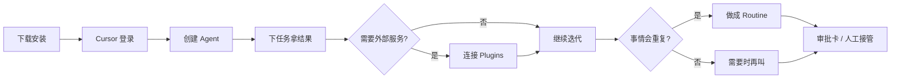

# 认识 Grok Bot：能真正干活的 AI 队友

> 本文面向第一次接触 Grok Bot 的读者，系统介绍它是什么、能做什么、怎么上手，以及适合放在哪些真实工作场景里。

---

## 一、Grok Bot 是什么？

Grok Bot 是由 SpaceXAI / Cursor 推出的**桌面端 AI 智能体（Agent）应用**。它不是只会在对话框里回答问题的聊天机器人，而是一组可以**长期留存、各自有角色、能在云端电脑上持续干活**的 AI 队友。

你可以把它理解成：

- **不是**一次性问答工具（问完即走）
- **而是**可以常驻的工作伙伴：记住你的偏好与上下文，跨应用执行多步骤任务，关掉电脑后也能继续跑

目前它提供桌面端（macOS / Windows / Linux）与移动端配套应用（iOS / Android），同一账号下的 Bot 与对话可跨设备同步。产品仍在持续迭代（公开材料中标注为 beta），面向具备资格的 Cursor / SuperGrok 等订阅用户开放。

---

## 二、它做什么？核心能力一览

### 1. 拥有一台「自己的电脑」

每个账号会分配一台**持久化的云端电脑**（Cloud Computer）。你的多个 Bot 共用这台电脑上的文件、浏览器登录态与工具环境，因此：

- 任务不会因为你合上笔记本而中断
- Bot 可以在真实网页、桌面应用里点选、填写、下载、整理
- 没有现成 API / 连接器的服务，也能通过浏览器完成工作

注意：电脑是**按账号共享**的，不要把「不同 Bot」当成安全隔离边界。

### 2. 连接真实工具与插件（Connectors / Plugins）

Grok Bot 可通过连接器接入日历、代码仓库、协作工具、数据库等服务。有连接器时优先用连接器（更稳定、结构更清晰）；没有连接器时，再落到浏览器自动化，并由你亲自完成登录等敏感步骤（Bot 看不到你的密码）。

### 3. 多 Bot 协作，像带一支小团队

你可以创建多个角色鲜明的 Bot，例如：

- 首席助理 / 总调度
- 工程排障
- 内容编辑
- 销售跟进
- 运营报销

它们可以并行工作、互相传话、在群聊里分工，只在需要你拍板时把你拉进来。

### 4. 例行任务（Routines）与可复用技能（Skills）

- **Skill（技能）**：描述「这件事该怎么做」
- **Routine（例程）**：指定「由哪个 Bot、在什么时间或事件触发时去做」

常见用法：每天晨报、PR 状态盯梢、邮箱发票入库、周报汇总等。你也可以先演示一遍流程（Teach），让 Bot 学成可复用的技能，再挂成例程自动跑。

### 5. 记忆与风格沉淀

单个 Bot 会保留角色设定、稳定偏好与过往工作摘要。用得越久，越像「懂你规矩」的同事：知道何时该请示、何时可以自己推进。

### 6. 安全与审批机制

涉及发送、删除、下单、改生产环境等高风险动作时，系统可通过 **Auto-review** 等机制暂停并征求你的批准。密码、验证码、人机验证等步骤会交还给你完成。

---

## 三、如何用：从安装到第一次交付

### Step 1：安装并登录

1. 前往官方下载页安装桌面端（或移动端）
2. 使用**同一套 Cursor 账号**登录，确保计划与用量归属正确
3. 确认当前计划已包含 Grok Bot 资格（常见路径包括部分 Cursor 计划或可关联的 SuperGrok / X Premium+ 等，以官网当前说明为准）

Grok Bot 的用量通常与 Grok / Cursor 的常规额度分开计算（具体计费以账户页为准）。

### Step 2：创建第一个 Bot

给它起名、选外观与头衔，并写清角色描述。好的描述会显著提高交付质量，例如：

> 「你是工程助理。优先查仓库与 CI，改代码前先说明风险；发消息或合并 PR 前必须先征求我同意。」

### Step 3：用「结果」而不是「步骤」下任务

直接说你要的结果，例如：

- 「把本周未合并的 PR 列成清单，标出卡在谁那里。」
- 「根据这份 brief 写一篇产品介绍，再给出 3 个标题备选。」
- 「每天早上 9 点汇总昨夜构建失败，并发到我这边。」

Bot 会自行拆解步骤；你随时可以追一句「停」「改成……」「先别发」来纠偏。

### Step 4：按需连接插件

当任务需要外部服务时，界面会出现 **Connect** 卡片，按提示完成授权即可。敏感密钥请走安全录入，不要粘贴到普通聊天或明文文件里。

### Step 5：需要时打开「电脑视图」

在 Agent 信息面板可预览其云端电脑画面。遇到登录、二次验证、支付确认等步骤时，把桌面交给你完成，再让 Bot 继续。

### Step 6：把重复工作固化成例程

同一件事做了两三次之后，让 Bot 把它存成 Routine，挂上日程或事件触发。之后你只需要看结果，而不是反复口述流程。

---

## 四、使用场景与案例

下列场景来自官方介绍中的真实用法抽象，便于对照自己的工作流。

### 场景 A：销售跟进闭环

**目标**：通话结束后，CRM 与跟进邮件自动更新。

**做法**：销售 Bot 读取通话纪要 → 写入 CRM 字段 → 起草跟进邮件 → 请你确认后发送。

**价值**：少掉「记完又忘发」的断点，把 90% 做到的事真正推到 100%。

### 场景 B：工程排障与交接

**目标**：线上问题从复现到建单再到修复交接。

**做法**：工程 Bot 在产品 UI 中复现 Bug → 整理复现步骤与环境 → 建工单 → 把修复交给调试向 Bot。

**价值**：排查与记录不再依赖某个人「在线才能推进」。

### 场景 C：运营与行政流水线

**目标**：新员工入职座位安排、邮箱发票报销入库。

**做法**：运营 Bot 监听邮件附件 → 识别发票 → 填入报销系统；另一 Bot 处理入职检查清单。

**价值**：高频、规则明确的工作最适合交给例程。

### 场景 D：内容与文创生产（编辑部）

**目标**：选题、大纲、成稿、多端适配一气呵成。

**做法**：

1. 主编 Bot 根据品牌调性产出选题池
2. 撰稿 Bot 按大纲成稿
3. 渠道 Bot 改写成公众号 / 小红书 / 官网版本
4. 定时 Routine 每周一给出选题周报

**价值**：把「灵感 → 交付」拆成可协作的流水线，而不是单次聊天碰运气。

### 场景 E：个人首席助理

**目标**：一个人同时管日程、邮件、研究与项目跟进。

**做法**：建一个总调度 Bot + 若干专长 Bot；总调度拆活、专长执行，只在关键口决策时找你。

**价值**：你从「每个细节都要亲手点」变成「只做判断」。

---

## 五、和普通 AI 助手差在哪？

| 维度 | 普通聊天助手 | Grok Bot |
| --- | --- | --- |
| 工作形态 | 问答为主 | 端到端执行任务 |
| 环境 | 对话框内 | 云端电脑 + 真实应用/网页 |
| 持续性 | 会话结束易断 | 后台与例程可持续运行 |
| 组织方式 | 通常单会话 | 多 Bot、群聊协作 |
| 学习方式 | 提示词临时约定 | 角色记忆 + 演示教学 + 例程 |
| 安全边界 | 多为建议 | 审批卡、人工接管敏感步骤 |

一句话：**聊天助手帮你想；Grok Bot 帮你办。**

---

## 六、上手建议（给第一次用的人）

1. **先给一个小而真的任务**（整理一份清单、起草一封邮件），建立信任后再扩大权限。
2. **角色描述写清楚边界**：什么可以自动做，什么必须先问你。
3. **能连插件就连插件**，浏览器自动化留给没有连接器的缺口。
4. **重复三次就例程化**，把精力留给例外情况。
5. **重要结论让 Bot 回查一手来源**，不要只靠记忆做决策。

---

## 七、小结

Grok Bot 的核心卖点不是「更会聊天」，而是：

> **给你一支能登录工具、能跨应用协作、能在你离开后继续推进的 AI 小团队。**

如果你已经在用 Cursor 或 SuperGrok 做开发与研究，Grok Bot 更适合承接那些「知道怎么做、但反复占用你时间」的运营型与跨应用工作——从跟进、排障、报销，到选题排期与内容生产。

下载入口与最新计划说明请以官方页面为准：

- 产品介绍：https://x.ai/news/introducing-grok-bot
- 入门文档：https://cursor.com/help/grok-bot/getting-started
- 下载页：https://cursor.com/download/bot

---

---

## 附录：图文操作步骤（上手实操）

下面按真实界面路径整理。路径以当前 Grok Bot 桌面端为准；个别菜单名称可能随版本微调，找不到时优先看侧边栏与聊天顶栏。

### 步骤 0：下载安装

1. 打开下载页：https://cursor.com/download/bot
2. 按系统选择安装包（macOS Apple Silicon / Intel，Windows x64 / ARM64，或 Linux 包）
3. 安装后启动应用

### 步骤 1：用 Cursor 账号登录

1. 打开 Grok Bot
2. 选择用 **Cursor 账号** 登录（与拥有计划 / 用量的账号保持一致）
3. 在 [设置 → Usage & Billing](grokbot://app/v1/settings?id=plan) 确认当前计划已包含 Grok Bot

打开设置的方式（任选其一）：

- 点侧边栏左下角 **头像 + 账号名**
- 快捷键 `Cmd+,`（Windows / Linux 多为 `Ctrl+,`）
- 命令面板里搜 `Open settings`

设置里常见分区：**General / Computer / Usage & Billing / Updates**。

### 步骤 2：创建第一个 Agent（Bot）

1. 在侧边栏新建 Agent
2. 填写名称、头像形状 / 颜色、头衔（Title）
3. 写一段角色描述（Description），把边界写清楚，例如：

> 你是内容主编。先给选题与大纲，成稿前先问我确认；不要擅自对外发送。

4. 进入新对话窗口，直接描述你要的**结果**并发送

### 步骤 3：下达任务与纠偏

推荐说法：

- 「整理本周未合并 PR，按负责人分组。」
- 「根据 brief 写产品介绍，并给 3 个标题。」
- 「先别发邮件，只给我草稿。」

随时可追加：

- 「停」
- 「改成更短」
- 「先问我再执行」

### 步骤 4：连接插件（Plugins）

当任务需要外部服务时，聊天里会出现 **Connect** 卡片；也可主动去插件页添加。

1. 桌面端：侧边栏选 **Plugins**（移动端：点左上角头像 → Plugins）
2. 搜索并添加所需插件（如 Gmail、Slack、Notion、日历等）
3. 按提示在浏览器完成 **Authorize / Authenticate**
4. 若显示 Waiting for authorization，点 **Reopen** 拉回授权页
5. 在 **Installed** 列表确认已安装

说明：

- 插件挂在账号上，账号下所有 Bot 通常都能用到该连接
- 公司 Google 账号可能需要管理员把 **Grok** 加入信任应用
- 密钥不要粘贴进普通聊天；用安全录入（Secrets）

### 步骤 5：查看 Agent 的云端电脑

1. 点聊天顶栏的 **Agent 名称**（或 `Cmd+Shift+I`）打开信息面板
2. 面板上方是该 Agent **电脑画面预览**；再点可进入全屏电脑视图
3. 同一面板下方可见 **Routines** 列表；有频道连接时还会显示 Channels
4. 面板标题旁的齿轮可改该 Agent 的头像、名称、头衔、描述与通知

遇到登录、验证码、支付等步骤时：把电脑视图交给你完成，完成后让 Bot 继续。

### 步骤 6：创建例程（Routine）

官方路径：打开该 Bot → **View conversation details** → **Routines**。

每个例程包含：名称、指令（Instruction）、**When to run**、Active 开关、Run history。

1. 新建例程，写清每次要做什么（写给未来的 Bot）
2. 在 When to run 里选触发方式：
   - 日程：每小时 / 每天 / 工作日 / 每周 / 每月 / 间隔 / 高级 / 自定义
   - 或事件：如 Slack 关键词、Webhook 等（以当前版本支持为准）
3. 打开 **Active**
4. 需要立刻验证时用 **Test run**（会真实执行并消耗用量）

注意：

- 时区看设置里的 Timezone
- 保存不会立刻跑一发；要等下一次匹配时间
- 日程间隔至少 5 分钟
- 关着笔记本，云端例程仍可运行

### 步骤 7：审批与安全

当 Bot 要执行敏感动作时，会出现审批卡（Auto-review）：

- **Allow once**：仅本次允许
- **Always allow**：同类以后可自动放行（写入规则）
- **Deny**：拒绝

密码、二次验证、人机验证等，用电脑接管由你本人完成。

建议在角色描述里写死边界，例如：「发邮件 / 发 Slack / 删除 / 下单前必须先问我。」

### 步骤 8：组织多个 Bot

- 用侧边栏 **Sections** 按项目 / 客户分组（桌面与手机可同步；需较新版本）
- 需要并行时：建专长 Bot + 一个总调度，让它们互相交接
- 删除 Bot：侧边栏对该行 **右键 → Delete**（永久删除对话与例程，需确认）

### 一张图看懂上手路径

### 常见卡点速查

| 现象 | 先试什么 |
| --- | --- |
| 电脑显示 Reconnecting / 连不上 | 等待重试 → 完全退出再开 → [Update Computer](grokbot://app/v1/settings?id=update-computer)；Reset 是最后手段 |
| 插件卡在授权 | Reopen 授权页；仍失败则卸了重装再授权 |
| 例程一直 No runs yet | 确认 Active；保存不会立刻跑；可用 Test run |
| 用量掉得很快 | 放宽例程频率；收窄 Slack 监听范围 |
| 找不到设置 | 侧边栏左下角账号入口，或 `Cmd+,` |

---

*文稿说明：功能与可用性以官方当前文档为准；平台支持、计费与计划名单可能随版本更新，引用前建议再核对一次官网。*
